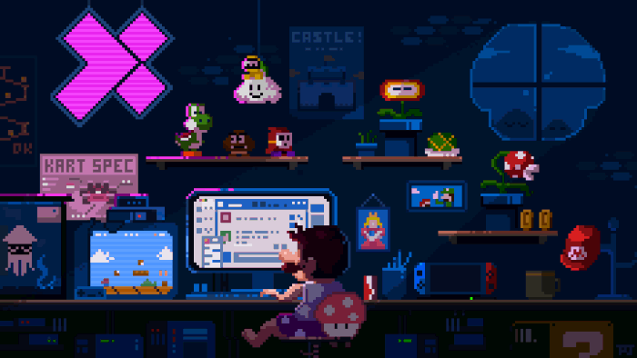

<h2 align="center">ᴏɪ, ᴍᴇ ᴄʜᴀᴍᴏ ᴅɪᴏɢᴏ, ᴇsᴛᴜᴅᴏ ᴅᴇsᴇɴᴠᴏʟᴠɪᴍᴇɴᴛᴏ ᴡᴇʙ, ᴀᴘᴀɪxᴏɴᴀᴅᴏ ᴘᴏʀ ɴᴏᴅᴇᴊs ᴇ ʀᴇᴀᴄᴛᴊs. ʙᴜsᴄᴏ ғʀᴇᴇʟᴀs.</h2>

  <table width="100%" border="0">
    <tr>
      <td colspan="2" align="center">
            <p>🌱 ᴀᴛᴜᴀʟᴍᴇɴᴛᴇ ᴇsᴛᴏᴜ ᴀᴘʀᴇɴᴅᴇɴᴅᴏ <strong>ʀᴇᴀᴄᴛᴊs, ɴᴏᴅᴇᴊs, ᴀᴘɪ ʀᴇsᴛ</strong></p>
            <p>💬 ᴘᴇʀɢᴜɴᴛᴇ-ᴍᴇ sᴏʙʀᴇ <strong>ɴᴏᴅᴇᴊs, ᴇxᴘʀᴇss, ᴛʏᴘᴇsᴄʀɪᴘᴛ, ᴊᴀᴠᴀsᴄʀɪᴘᴛ, ᴍʏsǫʟ, ᴍᴏɴɢᴏᴅʙ</strong></p>
            <p>⚡ Hobby <strong>Ler manga</strong></p>
      </td>
    </tr>
    <tr>
      <td colspan="2" align="center">
          
      </td>
    </tr>
    <tr>
        <td>
            
        </td>
        <td>
            
        </td>
    </tr>
    <tr>
      <td>
        
      </td>
      <td align="center">
          <a href="https://app.daily.dev/Suegoidkun"></a>
      </td>
    </tr>
  </table>

<h3 align="center">ʟ͟ᴀ͟ɴ͟ɢ͟ᴜ͟ᴀ͟ɢ͟ᴇ͟s͟:͟</h3>
<div align="center">
    
    
    
    
</div>

<h3 align="center">ᴛ͟ᴏ͟ᴏ͟ʟ͟s͟:͟</h3>
<div align="center">
    
    
    
    
    
    
    
    
</div>

<h3 align="center">ᴅ͟ᴀ͟ᴛ͟ᴀ͟ʙ͟ᴀ͟s͟ᴇ͟:͟</h3>
<div align="center">
    
    
    
    
    
    
    
</div>

<h3 align="center">ᴄ͟ᴏ͟ɴ͟ɴ͟ᴇ͟ᴄ͟ᴛ͟ ͟ᴡ͟ɪ͟ᴛ͟ʜ͟ ͟ᴍ͟ᴇ͟:͟</h3>
<div align="center">
    <a href="https://www.linkedin.com/in/diogo-jorge-br/" target="blank">
        
    </a>
    <a href="https://discord.gg/KZmDrSDB5U" target="blank">
        
    </a>
  <a href="https://anilist.co/user/Suegoidkun/">
      
  </a>
   <a href="mailto:diogojorge1401@gmail.com" target="blank">
      
    </a>
</div>

<div align="center" width="100%">
  <a href="#">
    
  </a>
</div>

<!--START_SECTION:waka-->


**Eu sou diurno 🐤** 

```text
🌞 Manhã                  1463 commits        ███░░░░░░░░░░░░░░░░░░░░░░   10.43 % 
🌆 Tarde                  5840 commits        ██████████░░░░░░░░░░░░░░░   41.64 % 
🌃 Noite                  4320 commits        ████████░░░░░░░░░░░░░░░░░   30.80 % 
🌙 Madrugada              2401 commits        ████░░░░░░░░░░░░░░░░░░░░░   17.12 % 
```
📅 **Sou mais produtivo em Terça-Feira** 

```text
Segunda-Feira            2109 commits        ████░░░░░░░░░░░░░░░░░░░░░   15.04 % 
Terça-Feira              2368 commits        ████░░░░░░░░░░░░░░░░░░░░░   16.89 % 
Quarta-Feira             2136 commits        ████░░░░░░░░░░░░░░░░░░░░░   15.23 % 
Quinta-Feira             1982 commits        ████░░░░░░░░░░░░░░░░░░░░░   14.13 % 
Sexta-Feira              2289 commits        ████░░░░░░░░░░░░░░░░░░░░░   16.32 % 
Sábado                   1784 commits        ███░░░░░░░░░░░░░░░░░░░░░░   12.72 % 
Domingo                  1356 commits        ██░░░░░░░░░░░░░░░░░░░░░░░   09.67 % 
```


📊 **Esta semana eu gastei meu tempo em** 

```text
🕑︎ Fuso horário: America/Sao_Paulo

💬 Linguagens de programação: 
TypeScript               6 hrs 21 mins       ██████████████░░░░░░░░░░░   54.93 % 
Other                    1 hr 48 mins        ████░░░░░░░░░░░░░░░░░░░░░   15.65 % 
Bash                     42 mins             ██░░░░░░░░░░░░░░░░░░░░░░░   06.14 % 
JavaScript               39 mins             █░░░░░░░░░░░░░░░░░░░░░░░░   05.68 % 
YAML                     34 mins             █░░░░░░░░░░░░░░░░░░░░░░░░   04.90 % 

🔥 Editores: 
VS Code                  11 hrs 3 mins       ████████████████████████░   95.55 % 
Obsidian                 30 mins             █░░░░░░░░░░░░░░░░░░░░░░░░   04.45 % 

🐱‍💻 Projetos: 
sirius-track-api         10 hrs 30 mins      ███████████████████████░░   90.92 % 
ReferralProjectOne       32 mins             █░░░░░░░░░░░░░░░░░░░░░░░░   04.64 % 
Unknown Project          30 mins             █░░░░░░░░░░░░░░░░░░░░░░░░   04.45 % 

💻 Sistema operacional: 
Linux                    11 hrs 33 mins      █████████████████████████   100.00 % 
```

**Eu geralmente programo em TypeScript** 

```text
TypeScript               60 repos            ██████████████░░░░░░░░░░░   54.05 % 
HTML                     15 repos            ███░░░░░░░░░░░░░░░░░░░░░░   13.51 % 
JavaScript               9 repos             ██░░░░░░░░░░░░░░░░░░░░░░░   08.11 % 
Python                   4 repos             █░░░░░░░░░░░░░░░░░░░░░░░░   03.60 % 
SCSS                     3 repos             █░░░░░░░░░░░░░░░░░░░░░░░░   02.70 % 
```


 Last Updated on 04/03/2024 00:42:50 UTC
<!--END_SECTION:waka-->

<div align="center">
    <h3 align="center">𝕰𝖘𝖈𝖗𝖊𝖛𝖆 𝖆𝖑𝖌𝖔 𝖇𝖔𝖒 𝖓𝖔 𝖒𝖊𝖚 𝖑𝖎𝖛𝖗𝖔 𝖉𝖊 𝖛𝖎𝖘𝖎𝖙𝖆𝖘:</h3>
    <div align="center">
        <a href="https://github.com/DiogoJorge1401/DiogoJorge1401/issues">
          
        </a>
     </div>
  </div>

<div align="center">
  <h3>Profile Views</h3>
  
  <span>counting of visitors to this page in this section started from May 12, 2023</span>

  
</div>
</br>

<div align="center">
  <h2>𝓞𝓫𝓻𝓲𝓰𝓪𝓭𝓸 𝓹𝓸𝓻 𝓿𝓮𝓻 𝓶𝓮𝓾 𝓹𝓮𝓻𝓯𝓲𝓵 <3<h2>

  <hr />

 
<div>
